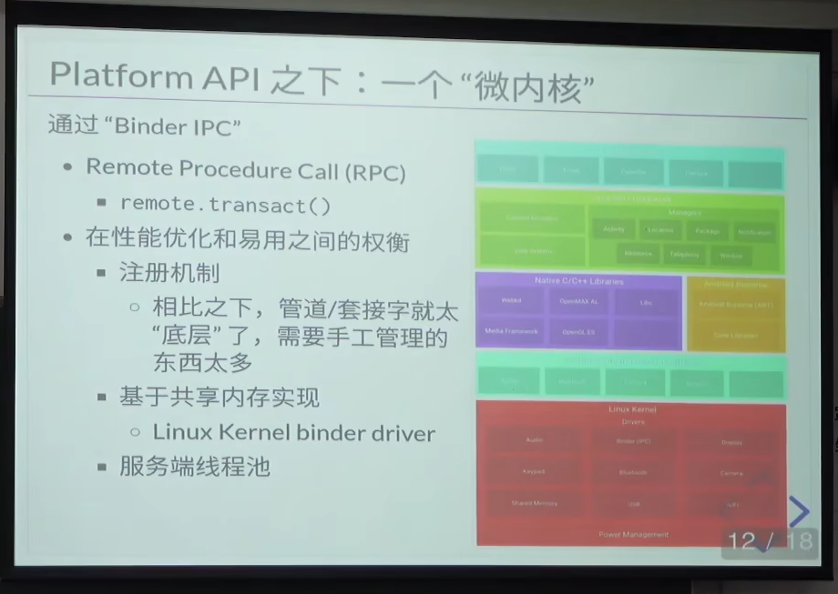

### BinderIPC 安卓系统里面独特的进程间通信机制

实际上是一个远程过程调用。

客户端进程发送请求。

服务端进程接收到请求，检查，执行请求，然后返回结果。

---

服务端注册自己提供的函数。

---

在Camera 中会用到，仔细看蒋炎岩的B站视频。

这也是为什么Camera 中会有CameraService 的原因。摄像头实际上是由CameraService来管理的。

CameraService处于framework 层。

### Binder IPC 图示

