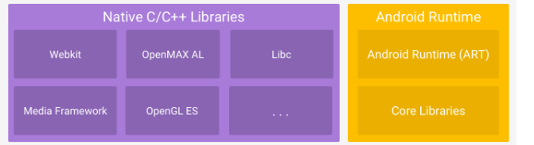

**Java核心库(Core Libraries)**：

安卓架构里面，安卓运行时环境中的core libraries 是用大部分java 语言写的。

- 这些库提供了Java编程语言的基本功能，如集合框架（如`java.util.List`、`java.util.Map`）、I/O处理（如`java.io`）、字符串操作（如`java.lang.String`）、多线程（如`java.lang.Thread`）等。
- 这些库的实现与标准的Java SE（Java Standard Edition）类似，但针对安卓平台进行了优化。

注：就跟你之前学的java SDK 里面的集合框架那些。

- 

### 实现语言

- **Java**：大部分核心库的代码是用Java编写的。开发者可以直接使用这些库来开发安卓应用。
- **JNI（Java Native Interface）**：一些核心库的底层实现可能会调用本地（native）代码。JNI允许Java代码与用其他编程语言（如C或C++）编写的本地代码进行互操作。这在需要高性能或直接访问硬件的场景中特别有用。
- **C/C++**：某些低级别的库（如Android Runtime中的ART虚拟机和一些性能关键的库）是用C或C++编写的。这些库通过JNI提供Java接口。

### 总结

Android Runtime（ART）和其核心库的绝大部分代码是用Java编写的。这些库提供了安卓应用开发所需的各种功能。对于某些性能关键的部分，底层实现可能会使用C或C++，并通过JNI与Java代码进行交互。
